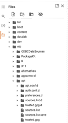

Here are the issues in the CoLab and how to fix

Problem 1: 
```
!sudo apt remove gcc gcc-7 g++ g++-7
!sudo apt install gcc-6 g++-6
```
This command is outdated as gcc6 is no longer supported on the current version 

Solution of Problem 1: 

1. Go to sources.list, Add (deb http://dk.archive.ubuntu.com/ubuntu/ bionic main universe) at the end of the file, Hit command+s (Mac) to save the changes
2.	Add !sudo apt update as a code cell before you install gcc6


Problem 2:
```
# !sed -i "1254s/torch\.backends\.cudnn\.enabled/False/g" /usr/local/lib/python3.7/dist-packages/torch/nn/functional.py 
```

Solution: Change 3.7 to 3.10

Note: 
!git clone https://github.com/cocodataset/cocoapi.git 
For the first time you run the colab, you should remove the # and actually clone the file into your Google Drive 

Problem 3: 
cd /content/drive/My Drive/COCOAPI/PythonAPI

Solution: Change to cd /content/drive/My Drive/COCOAPI/cocoapi/PythonAPI

Problem 4: 
Between cd /content/drive/My Drive/COCOAPI/cocoapi/PythonAPI and !make, add !pip install cython pycocotools


Problem 5:
Between 
```
%cd /content/drive/My\ Drive/CircleNet/src 
```
and 
```
!python run_detection_for_scn.py circledet --arch dla_34 --demo "/content/drive/My Drive/CircleNet/example_case/Case 03-1.s
```
add 
```
!pip install Pillow==6.2
```
Note: 
In your Google Drive, 
1.	Download (clone) the CircleNet file under My Drive (similar to what we do to COCOAPI)
2.	Download two files under Whole Slide Image (case 03-1.scn & model_10.pth) and put them into according place following 
a.	My Drive/CircleNet/example_case/Case 03-1.scn
b.	My\ Drive/CircleNet/trained_model/model_10.pth

If you have trouble finding ideep4py in command !sudo ln -sf /usr/local/lib/python3.10/dist-packages/ideep4py/lib/libmkldnn.so.0.14.0 /usr/local/lib/python3.10/dist-packages/ideep4py/lib/libmkldnn.so.0, 
You can just comment it out and won’t affect the result


